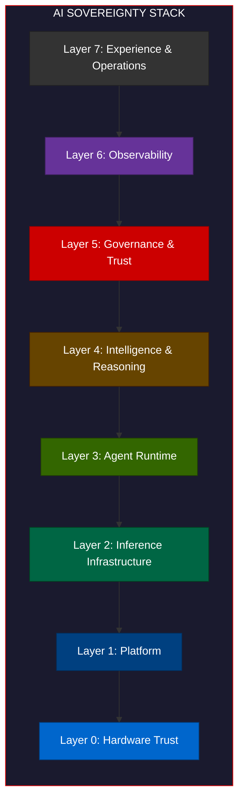

# AI Sovereignty Portfolio

**50 repos. One stack. Everything composes into provable AI governance on your own infrastructure.**

The AI Sovereignty Stack is the reference architecture. The platforms are the integrated systems that implement it. The quickstarts are the composable building blocks that feed into those platforms.

---

## The Stack

---

## Platforms

Integrated systems that implement multiple layers of the stack.

| Platform | Org | Layers | Description |
|----------|:---:|:------:|-------------|
| [sovereign-ai-lab](https://github.com/jkershawrh/sovereign-ai-lab) | both | 0-7 | 7-layer sovereign AI stack with tamper-evident proof chain |
| [fleet-llm-d](https://github.com/jkershawrh/fleet-llm-d) | jkershawrh | 2-6 | Fleet-level inference orchestration. 437 tests, 36 proofs. |
| [triforce](https://github.com/rhpds/triforce) | rhpds | 1-4 | Red Hat + IBM + Intel multi-agent platform. LangGraph, Kagenti, Xeon 6. |
| [launchpad](https://github.com/rhpds/launchpad) | rhpds | 1-2 | AI demo platform with Intel Gaudi 3. One-click partner demos. |
| [stargate](https://github.com/rhpds/stargate) | rhpds | 6-7 | Continuous ops for RHDP. AI failure classification, auto-remediation. |
| [GeoLux](https://github.com/rhpds/GeoLux) | rhpds | 4-5 | Governed agentic inference. Geometric stability, hypothesis reasoning. |
| [deepfield](https://github.com/rhpds/deepfield) | rhpds | 3-4 | Fleet-scale signal intelligence. Nano-agent telemetry compression. |
| [deepfield-fleet](https://github.com/jkershawrh/deepfield-fleet) | jkershawrh | 3-6 | Predictive brain for fleet-llm-d. Signal classification + intent emission. |
| [deepfield-multimodal](https://github.com/jkershawrh/deepfield-multimodal) | both | 3-4 | Three-tier agent cascade (nano/micro/macro) on Intel Xeon 6. |
| [are-immutable-ledger](https://github.com/jkershawrh/are-immutable-ledger) | jkershawrh | 5 | Rust gRPC + REST. SHA-256 hash chaining, proof receipts. 116 tests. |

---

## Quickstarts by Stack Layer

### Layer 0: Hardware Trust

| Quickstart | One-Line Pitch | Intel |
|-----------|----------------|:-----:|
| [confidential-ai-inference](https://github.com/jkershawrh/confidential-ai-inference) | AES-256-XTS encrypted inference in Intel TDX Trust Domains | TDX |
| [cpu-model-optimization-benchmark](https://github.com/jkershawrh/cpu-model-optimization-benchmark) | FP32 vs INT8 vs INT4 with AMX toggle, side-by-side | AMX |
| [edge-ai-cpu-inference](https://github.com/jkershawrh/edge-ai-cpu-inference) | 2.4B params in 400MB, integer math, no GPU | Xeon |

### Layer 2: Inference Infrastructure

| Quickstart | One-Line Pitch | Intel |
|-----------|----------------|:-----:|
| [vllm-gaudi-inference-server](https://github.com/jkershawrh/vllm-gaudi-inference-server) | vLLM on Intel Gaudi HPUs, OpenAI-compatible API | Gaudi |
| [openvino-cpu-inference-server](https://github.com/jkershawrh/openvino-cpu-inference-server) | OpenVINO IR + INT8 on Xeon, OpenAI-compatible | OpenVINO |
| [disaggregated-inference-scheduler](https://github.com/jkershawrh/disaggregated-inference-scheduler) | Separate prefill/decode across node pools with SLO scheduling | llm-d |
| [speculative-decoding-accelerator](https://github.com/jkershawrh/speculative-decoding-accelerator) | Draft model in L3 cache proposes, target verifies | Xeon |
| [gpu-model-placement-optimizer](https://github.com/jkershawrh/gpu-model-placement-optimizer) | LP for minimum-cost model-to-GPU assignment | Gaudi |
| [cost-aware-request-routing](https://github.com/jkershawrh/cost-aware-request-routing) | Sub-ms embedding classification routes to cheapest capable model | Xeon |
| [enterprise-rag-intel-continuum](https://github.com/jkershawrh/enterprise-rag-intel-continuum) | Xeon handles 3/4 RAG steps, Gaudi handles generation | Xeon+Gaudi |

### Layer 3: Agent Runtime

| Quickstart | One-Line Pitch | Intel |
|-----------|----------------|:-----:|
| [three-tier-classification-cascade](https://github.com/jkershawrh/three-tier-classification-cascade) | 98% classified on CPU before anything expensive runs | Xeon |
| [hardware-tiered-agent-swarm](https://github.com/jkershawrh/hardware-tiered-agent-swarm) | 8 agents across 3 Intel hardware lanes in waves | Xeon+Gaudi |
| [multi-agent-health-assistant](https://github.com/jkershawrh/multi-agent-health-assistant) | 3 agents cooperate via A2A protocol | A2A |
| [mcp-federated-tools](https://github.com/jkershawrh/mcp-federated-tools) | 16ms federated lookup replaces 3-8s LLM call | MCP |
| [ai-pipeline-bootstrap](https://github.com/jkershawrh/ai-pipeline-bootstrap) | One LLM call generates an entire classification pipeline | Xeon |
| [multimodal-evidence-classifier](https://github.com/jkershawrh/multimodal-evidence-classifier) | 5 modalities through common schema with ONNX/OpenVINO | OpenVINO |

### Layer 4: Intelligence & Reasoning

| Quickstart | One-Line Pitch |
|-----------|----------------|
| [hypothesis-driven-reasoning](https://github.com/jkershawrh/hypothesis-driven-reasoning) | LLM asks falsifiable questions, deterministic code validates |
| [llm-root-cause-hypothesis](https://github.com/jkershawrh/llm-root-cause-hypothesis) | Cross-modal evidence correlates into LLM root cause hypothesis |
| [llm-stability-scoring](https://github.com/jkershawrh/llm-stability-scoring) | Logprob-based confidence scoring: know when your LLM is hallucinating |
| [llm-structured-output-repair](https://github.com/jkershawrh/llm-structured-output-repair) | Schema validation + iterative correction for reliable structured output |
| [multi-model-consensus](https://github.com/jkershawrh/multi-model-consensus) | 3 models answer in parallel, a judge synthesizes consensus |
| [ai-rule-proposal-pipeline](https://github.com/jkershawrh/ai-rule-proposal-pipeline) | AI proposes its own rule improvements as PR-ready markdown |

### Layer 5: Governance & Trust

| Quickstart | One-Line Pitch |
|-----------|----------------|
| [agent-promotion](https://github.com/jkershawrh/agent-promotion) | 5-tier authority earned by track record, revoked on failure |
| [governed-cognitive-loop](https://github.com/jkershawrh/governed-cognitive-loop) | LLM-MPC with evidence-based constraint classification and falsification |
| [governed-agent-execution](https://github.com/jkershawrh/governed-agent-execution) | Intent, risk, plan, and policy gates before any agent acts |
| [llm-adversarial-falsification](https://github.com/jkershawrh/llm-adversarial-falsification) | 7 deterministic safety checks + LLM adversarial probing before commit |
| [agent-governance-kubernetes](https://github.com/jkershawrh/agent-governance-kubernetes) | Kagenti CRDs + SPIFFE identity on OpenShift |
| [agent-certification-battery](https://github.com/jkershawrh/agent-certification-battery) | 6-check behavioral validation before production deployment |
| [agent-identity-verification](https://github.com/jkershawrh/agent-identity-verification) | 768-D embedding fingerprints detect impersonation (3.6% EER) |
| [llm-response-quality-gate](https://github.com/jkershawrh/llm-response-quality-gate) | 10 check types across BDD/CDD/EDD/TDD dimensions |

### Layer 6: Observability

| Quickstart | One-Line Pitch |
|-----------|----------------|
| [inference-anomaly-detector](https://github.com/jkershawrh/inference-anomaly-detector) | Z-score on TTFT, throughput, KV-cache degradation in real time |
| [behavioral-drift-detector](https://github.com/jkershawrh/behavioral-drift-detector) | 36 behavioral metrics with Hotelling T-squared drift detection |
| [slo-forecasting-predictive-scaling](https://github.com/jkershawrh/slo-forecasting-predictive-scaling) | Predict SLO breach 12 min ahead, pre-warm from calendar |
| [closed-loop-ai-feedback](https://github.com/jkershawrh/closed-loop-ai-feedback) | Signal, decide, act, verify, learn: proves AI recommendations work |
| [aiops-copilot](https://github.com/jkershawrh/aiops-copilot) | Classify alerts on Xeon, correlate, RCA on Gaudi, governance gates |

### Layer 7: Experience & Operations

| Quickstart | One-Line Pitch |
|-----------|----------------|
| [hybrid-fraud-detection](https://github.com/jkershawrh/hybrid-fraud-detection) | 60% rules + 40% LLM, skip LLM 70% of the time |

---

## Composition Map

How quickstarts feed into platforms.

```mermaid
graph LR
    subgraph PLATFORMS["Platforms"]
        FLEET["fleet-llm-d"]
        DEEP["deepfield"]
        SAL["sovereign-ai-lab"]
    end

    subgraph INF["Inference"]
        vllm["vllm-gaudi"]
        ovino["openvino-cpu"]
        edge["edge-ai-cpu"]
        disag["disaggregated-scheduler"]
        spec["speculative-decoding"]
        gpu["gpu-placement"]
        cost["cost-aware-routing"]
    end

    subgraph AGT["Agents"]
        cascade["3-tier-cascade"]
        swarm["hw-tiered-swarm"]
        mevid["multimodal-classifier"]
        pipe["pipeline-bootstrap"]
    end

    subgraph REASON["Reasoning"]
        hypo["hypothesis-reasoning"]
        rca["root-cause-hypothesis"]
        stab["stability-scoring"]
        cons["multi-model-consensus"]
    end

    subgraph GOV["Governance"]
        promo["agent-promotion"]
        gcl["governed-cognitive-loop"]
        gae["governed-agent-exec"]
        adv["adversarial-falsification"]
        agk["agent-gov-k8s"]
        cert["agent-certification"]
        ident["agent-identity"]
        qgate["response-quality-gate"]
    end

    subgraph OBS["Observability"]
        anom["anomaly-detector"]
        drift["drift-detector"]
        slo["slo-forecasting"]
        cloop["closed-loop-feedback"]
        aiops["aiops-copilot"]
    end

    subgraph TRUST["Trust Infra"]
        ledger["are-immutable-ledger"]
        tdx["confidential-ai"]
    end

    vllm & ovino & edge & disag & spec --> FLEET
    gpu & cost & swarm --> FLEET
    anom & drift & slo --> FLEET

    cascade & mevid & pipe --> DEEP
    hypo & rca & stab --> DEEP
    cloop & aiops --> DEEP

    ledger & tdx --> SAL
    promo & gcl & gae & adv --> SAL
    agk & cert & ident & qgate --> SAL

    style PLATFORMS fill:#cc0000,stroke:#990000,color:#fff
    style INF fill:#006644,stroke:#004422,color:#fff
    style AGT fill:#336600,stroke:#224400,color:#fff
    style REASON fill:#664400,stroke:#442200,color:#fff
    style GOV fill:#880000,stroke:#660000,color:#fff
    style OBS fill:#663399,stroke:#442266,color:#fff
    style TRUST fill:#0066cc,stroke:#004080,color:#fff
```

---

## Other / Support

| Repo | Org | Role |
|------|:---:|------|
| [synthetic-maas](https://github.com/jkershawrh/synthetic-maas) | jkershawrh | GPU-free MaaS emulator for fleet-llm-d testing |
| [slo-sli-automation](https://github.com/jkershawrh/slo-sli-automation) | jkershawrh | SLO/SLI generator and drift detector (Go+Python CLI) |
| [geolux-agentic-signature-compromise-drift](https://github.com/jkershawrh/geolux-agentic-signature-compromise-drift) | jkershawrh | Research: behavioral fingerprinting for agent identity |
| [red-hat-intel-partnership-demo](https://github.com/rhpds/red-hat-intel-partnership-demo) | rhpds | Original partner demo (predecessor to quickstarts) |

---

## Gap Analysis: What is Missing

The stack has strong coverage in inference (Layer 2), agent runtime (Layer 3), governance (Layer 5), and observability (Layer 6). The gaps are at the boundaries: data, lifecycle, compliance reporting, and cost governance.

### Critical Gaps

| Gap | Layer | What It Would Do | Why It Matters |
|-----|:-----:|-----------------|----------------|
| **Data Sovereignty Engine** | 1-5 | Classify data by jurisdiction (GDPR, Gulf, PDPA), enforce residency policies, prove data never left the region | sovereign-ai-lab has OPA policies for this but no standalone quickstart. EU AI Act requires provable data residency. |
| **Model Provenance Registry** | 2-5 | Track model origin, training data lineage, AIBOM, version history, tamper detection | sovereign-ai-lab has OPA promotion gates but no dedicated model supply chain provenance service. |
| **Compliance Report Generator** | 5-7 | Turn the ledger proof chain into human-readable compliance artifacts (EU AI Act, SOC 2, NIST AI RMF) | The ledger records everything, but auditors need formatted reports, not raw hash chains. |

### Important Gaps

| Gap | Layer | What It Would Do | Why It Matters |
|-----|:-----:|-----------------|----------------|
| **AI FinOps / Cost Governance** | 2-7 | Budget ceilings per team/agent, spend tracking, cost attribution across inference tiers | cost-aware-request-routing optimizes per-request cost, but no budget governance layer exists. Enterprises need "this team can spend $X/month on inference." |
| **Operator Console** | 7 | Unified human-in-the-loop dashboard for reviewing agent decisions, ratification queues, drift alerts, and compliance status | agent-promotion has a demo UI, stargate has a dashboard, but no single-pane-of-glass for the full stack. |
| **Red Team / Adversarial Framework** | 5 | Systematic prompt injection, jailbreak, model extraction, and agent manipulation testing | llm-adversarial-falsification checks before actions, but no offensive testing framework for the stack as a whole. |

### Nice-to-Have Gaps

| Gap | Layer | What It Would Do | Why It Matters |
|-----|:-----:|-----------------|----------------|
| **Federated Fine-Tuning** | 2 | Train or fine-tune models on sovereign data without data leaving the boundary | All repos are inference-focused. Training sovereignty is the other half of the story. |
| **Air-Gap Deployment** | 1-2 | Fully disconnected deployment with bundled models, no external registry or API calls | Implied by CPU inference + confidential compute, but no explicit air-gap quickstart. |
| **Multi-Tenant Isolation** | 1-3 | Namespace-level agent isolation with per-tenant governance policies | agent-governance-kubernetes uses CRDs but does not demonstrate multi-tenant separation. |

---

## Repo Count

| Category | Count |
|----------|:-----:|
| Platforms | 10 |
| Quickstarts | 34 |
| Support / Other | 4 |
| Missing (identified) | 6-9 |
| **Total existing** | **48** |

---

## License

Apache 2.0
