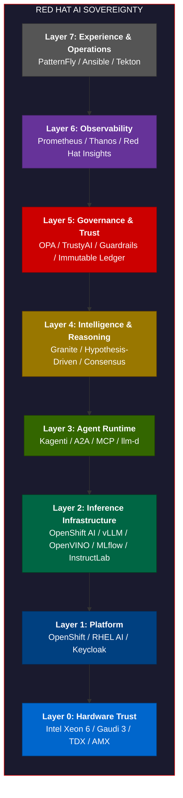
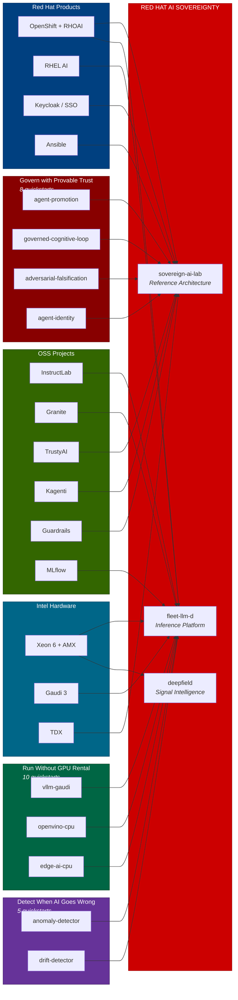

# Red Hat AI Sovereignty

**The premium on-premises AI platform. On par with the hyperscalers. On your infrastructure.**

The hyperscalers ask you to trust them with your AI. Red Hat gives you the platform to trust yourself, and the proof chain to show your auditor.

---

## The Pitch

Every enterprise running AI faces the same question: who controls it?

With a hyperscaler, the answer is the hyperscaler. Your data crosses a boundary you don't own. Your models run on infrastructure you don't control. Your governance is a promise, not a proof. And when the regulator asks for evidence, you get a PDF from a vendor.

Red Hat AI Sovereignty is the alternative. The same capabilities. Your infrastructure. Your governance. Your proof.

---

## Where Red Hat Leads

Two areas where Red Hat is ahead of every hyperscaler, confirmed by market research (July 2026):

### 1. Confidential AI Inference (Production, GA)

Red Hat shipped Confidential Containers on OpenShift AI with Intel TDX. Models are encrypted at source and decrypted only inside hardware Trust Domains after cryptographic attestation. The two-cluster architecture (Trustee runs outside the cloud, workload runs inside TEEs) means not even the infrastructure provider can access the model or data.

Azure has TDX VMs (GA Feb 2026). AWS has Nitro. Google has GKE TEEs. But all of them lock you to their cloud. Red Hat is the only vendor where confidential AI runs on infrastructure you own.

**What proves it:** [confidential-ai-inference](https://github.com/jkershawrh/confidential-ai-inference), [sovereign-ai-lab](https://github.com/jkershawrh/sovereign-ai-lab) Layer 0

### 2. Sovereign Models-as-a-Service (Production, GA)

OpenShift AI 3.4 (May 2026) shipped Models-as-a-Service with sovereign service provisioning: GPU-as-a-Service, inferencing-as-a-Service, and model serving where inference telemetry never leaves the customer boundary. Red Hat Lightspeed offers three deployment tiers (hosted, proxied, on-premise) with zero external data flow in on-premise mode.

No hyperscaler offers MaaS where the telemetry stays yours. Their model serving APIs send usage data back to the provider.

**What proves it:** [fleet-llm-d](https://github.com/jkershawrh/fleet-llm-d), [launchpad](https://github.com/rhpds/launchpad), [vllm-gaudi-inference-server](https://github.com/jkershawrh/vllm-gaudi-inference-server)

---

## The Complete Stack

Eight layers. Every layer mapped to Red Hat products, Intel hardware, open-source projects, and the platforms and quickstarts that prove it works.



| Layer | Red Hat Product | OSS / Upstream | Intel Hardware | Platforms | Quickstarts |
|:-----:|----------------|---------------|----------------|-----------|-------------|
| 0 | RHEL Confidential Containers | Confidential Containers | **Xeon 6, Gaudi 3, TDX, AMX** | sovereign-ai-lab | confidential-ai, edge-ai-cpu, cpu-benchmark |
| 1 | **OpenShift**, **RHEL AI**, Red Hat SSO | Keycloak | | launchpad | |
| 2 | **OpenShift AI** (MLflow, KServe) | InstructLab, Granite, vLLM, OpenVINO, llm-d, Kueue, MLflow | | fleet-llm-d | 10 inference quickstarts |
| 3 | | Kagenti (A2A + MCP) | | triforce, deepfield-fleet, deepfield-multimodal, deepfield | 6 agent quickstarts |
| 4 | | Granite (open weights) | | GeoLux | 6 reasoning quickstarts |
| 5 | | TrustyAI, OPA, Guardrails Orchestrator | | sovereign-ai-lab, are-immutable-ledger | 8 governance quickstarts |
| 6 | **Red Hat Insights** | Prometheus, Thanos | | stargate | 5 observability quickstarts |
| 7 | **Ansible**, **OpenShift Pipelines** | PatternFly, Tekton | | stargate | 1 domain quickstart |

---

## Hyperscaler Comparison

| Capability | Hyperscaler | Red Hat + Intel | Advantage |
|-----------|------------|-----------------|-----------|
| Model serving | SageMaker / Vertex / Azure AI | **OpenShift AI** + vLLM + OpenVINO | Portable, not cloud-locked |
| Model registry | Vendor-locked | **MLflow** (open source) | No lock-in |
| Model training | Cloud APIs | **InstructLab** + **RHEL AI** | Train on your data, on your hardware |
| Open models | Closed APIs | **Granite** (Apache 2.0) | Inspect the weights |
| Agent runtime | Bedrock / Vertex Agents | **Kagenti** + A2A + MCP | Open standards |
| Guardrails | Vendor guardrails | **Guardrails Orchestrator** | Open source, auditable |
| Fairness | SageMaker Clarify | **TrustyAI** | Open source |
| Identity | Cloud IAM | **Keycloak** | Your directory |
| Policy | Cloud-native IAM | **OPA/Gatekeeper** | Your code |
| Compliance | Shared responsibility PDF | **Immutable ledger** + proof receipts | Your proof, not a promise |
| Confidential compute | Nitro / TDX VMs (cloud-locked) | **CoCo on OpenShift** + Intel TDX | Runs on your hardware |
| Cost management | Cloud billing | **OpenShift Cost Management** + Kueue | You own the telemetry |
| Observability | CloudWatch / Vertex | **Prometheus/Thanos** | You own the data |
| CI/CD for AI | SageMaker Pipelines | **Tekton** + OpenShift Pipelines | Open source |
| Console | Cloud console | **PatternFly** + OpenShift Console | Open source |
| Hardware | GPU rental | **Intel Xeon 6 + Gaudi 3** | You own the silicon |

---

## Platforms

Ten integrated systems that prove the stack works end-to-end.

| Platform | Stack Layers | What It Proves | Red Hat Products Used |
|----------|:-----------:|---------------|----------------------|
| [sovereign-ai-lab](https://github.com/jkershawrh/sovereign-ai-lab) | 0-7 | All 7 layers compose on one Xeon node | OpenShift, OPA, CoCo, OVMS, Keycloak |
| [fleet-llm-d](https://github.com/jkershawrh/fleet-llm-d) | 2-6 | Fleet inference orchestration at scale (437 tests) | OpenShift AI, vLLM, llm-d, Prometheus |
| [triforce](https://github.com/rhpds/triforce) | 1-4 | Red Hat + IBM + Intel multi-agent platform | OpenShift, Kagenti, Granite, Kafka |
| [deepfield-fleet](https://github.com/jkershawrh/deepfield-fleet) | 3-6 | Predictive signal intelligence is composable | OpenShift, OpenVINO, Prometheus |
| [deepfield-multimodal](https://github.com/jkershawrh/deepfield-multimodal) | 3-4 | Three-tier cascade runs on Xeon 6 | OpenShift, OpenVINO |
| [launchpad](https://github.com/rhpds/launchpad) | 1-2 | One-click sovereign AI demos on Gaudi 3 | OpenShift AI, vLLM |
| [stargate](https://github.com/rhpds/stargate) | 6-7 | AI-driven ops at RHDP scale | OpenShift, PatternFly, Keycloak, Granite |
| [GeoLux](https://github.com/rhpds/GeoLux) | 4-5 | Governed agentic inference is production-viable | OpenShift, OPA, Granite |
| [deepfield](https://github.com/rhpds/deepfield) | 3-4 | Fleet-scale signal intelligence compresses telemetry | OpenShift, OpenVINO |
| [are-immutable-ledger](https://github.com/jkershawrh/are-immutable-ledger) | 5 | Hash-chained proof receipts are tamper-evident (116 tests) | PostgreSQL on OpenShift |

---

## Quickstarts as Business Proof Points

Each quickstart proves a claim that matters in a boardroom.

### "We can govern AI agents with provable trust"

| Quickstart | Proof Point | Red Hat Integration |
|-----------|-------------|---------------------|
| [agent-promotion](https://github.com/jkershawrh/agent-promotion) | Authority earned by track record, revoked on failure. 180 tests. | Ledger proof chain, OpenShift deploy |
| [governed-cognitive-loop](https://github.com/jkershawrh/governed-cognitive-loop) | Evidence-based constraint classification and falsification. | Ledger, OpenShift deploy |
| [governed-agent-execution](https://github.com/jkershawrh/governed-agent-execution) | Intent, risk, plan, and policy gates before any agent acts. | OPA policies |
| [llm-adversarial-falsification](https://github.com/jkershawrh/llm-adversarial-falsification) | 7 safety checks + adversarial probing before commit. | Guardrails Orchestrator |
| [agent-governance-kubernetes](https://github.com/jkershawrh/agent-governance-kubernetes) | Kagenti CRDs + SPIFFE identity on OpenShift. | Kagenti, SPIFFE |
| [agent-certification-battery](https://github.com/jkershawrh/agent-certification-battery) | 6-check behavioral validation before production. | Tekton pipeline |
| [agent-identity-verification](https://github.com/jkershawrh/agent-identity-verification) | Embedding fingerprints detect impersonation (3.6% EER). | TrustyAI |
| [llm-response-quality-gate](https://github.com/jkershawrh/llm-response-quality-gate) | 10 check types across BDD/CDD/EDD/TDD dimensions. | OpenShift Pipelines |

### "We can run inference without a GPU rental"

| Quickstart | Proof Point | Intel |
|-----------|-------------|:-----:|
| [edge-ai-cpu-inference](https://github.com/jkershawrh/edge-ai-cpu-inference) | 2.4B params in 400MB, integer math, no GPU. | Xeon |
| [openvino-cpu-inference-server](https://github.com/jkershawrh/openvino-cpu-inference-server) | OpenVINO IR + INT8, OpenAI-compatible. | OpenVINO |
| [confidential-ai-inference](https://github.com/jkershawrh/confidential-ai-inference) | AES-256-XTS encrypted inference in TDX. | TDX |
| [vllm-gaudi-inference-server](https://github.com/jkershawrh/vllm-gaudi-inference-server) | vLLM on Gaudi HPUs, OpenAI-compatible. | Gaudi |
| [cpu-model-optimization-benchmark](https://github.com/jkershawrh/cpu-model-optimization-benchmark) | FP32 vs INT8 vs INT4 with AMX toggle. | AMX |
| [speculative-decoding-accelerator](https://github.com/jkershawrh/speculative-decoding-accelerator) | Draft model in L3 cache, target verifies. | Xeon |
| [disaggregated-inference-scheduler](https://github.com/jkershawrh/disaggregated-inference-scheduler) | Prefill/decode separation with SLO scheduling. | llm-d |
| [gpu-model-placement-optimizer](https://github.com/jkershawrh/gpu-model-placement-optimizer) | LP for minimum-cost model-to-accelerator assignment. | Gaudi |
| [cost-aware-request-routing](https://github.com/jkershawrh/cost-aware-request-routing) | Sub-ms classification routes to cheapest model. | Xeon |
| [enterprise-rag-intel-continuum](https://github.com/jkershawrh/enterprise-rag-intel-continuum) | Xeon handles 3/4 RAG steps, Gaudi handles 1/4. | Xeon+Gaudi |

### "We can match hyperscaler agent frameworks"

| Quickstart | Proof Point |
|-----------|-------------|
| [three-tier-classification-cascade](https://github.com/jkershawrh/three-tier-classification-cascade) | 98% classified on CPU before anything expensive runs. |
| [hardware-tiered-agent-swarm](https://github.com/jkershawrh/hardware-tiered-agent-swarm) | 8 agents across 3 Intel hardware lanes in waves. |
| [multi-agent-health-assistant](https://github.com/jkershawrh/multi-agent-health-assistant) | 3 agents cooperate via A2A protocol. |
| [mcp-federated-tools](https://github.com/jkershawrh/mcp-federated-tools) | 16ms federated lookup replaces 3-8s LLM call. |
| [ai-pipeline-bootstrap](https://github.com/jkershawrh/ai-pipeline-bootstrap) | One LLM call generates an entire pipeline. |
| [multimodal-evidence-classifier](https://github.com/jkershawrh/multimodal-evidence-classifier) | 5 modalities, common schema, ONNX/OpenVINO. |

### "We can detect when AI goes wrong"

| Quickstart | Proof Point |
|-----------|-------------|
| [inference-anomaly-detector](https://github.com/jkershawrh/inference-anomaly-detector) | Z-score on TTFT, throughput, KV-cache in real time. |
| [behavioral-drift-detector](https://github.com/jkershawrh/behavioral-drift-detector) | 36 metrics with Hotelling T-squared drift detection. |
| [slo-forecasting-predictive-scaling](https://github.com/jkershawrh/slo-forecasting-predictive-scaling) | Predict SLO breach 12 min ahead. |
| [closed-loop-ai-feedback](https://github.com/jkershawrh/closed-loop-ai-feedback) | Signal, decide, act, verify, learn. |
| [aiops-copilot](https://github.com/jkershawrh/aiops-copilot) | Classify, correlate, RCA with governance gates. |

### "Our AI can reason, not just generate"

| Quickstart | Proof Point |
|-----------|-------------|
| [hypothesis-driven-reasoning](https://github.com/jkershawrh/hypothesis-driven-reasoning) | Falsifiable questions, deterministic validation. |
| [llm-root-cause-hypothesis](https://github.com/jkershawrh/llm-root-cause-hypothesis) | Cross-modal evidence to root cause. |
| [llm-stability-scoring](https://github.com/jkershawrh/llm-stability-scoring) | Know when your LLM is hallucinating. |
| [llm-structured-output-repair](https://github.com/jkershawrh/llm-structured-output-repair) | Schema validation + iterative correction. |
| [multi-model-consensus](https://github.com/jkershawrh/multi-model-consensus) | 3 models, a judge, one verified answer. |
| [ai-rule-proposal-pipeline](https://github.com/jkershawrh/ai-rule-proposal-pipeline) | AI proposes its own rule improvements. |
| [hybrid-fraud-detection](https://github.com/jkershawrh/hybrid-fraud-detection) | 60% rules + 40% LLM, skip LLM 70% of the time. |

---

## Competitive Landscape (July 2026 Research)

Where Red Hat leads, where the market is, and where the whitespace is.

### Red Hat is Leading

| Area | Red Hat Position | Nearest Competitor | Why Red Hat Wins |
|------|-----------------|-------------------|-----------------|
| **Confidential AI** | CoCo on OpenShift AI (GA). Two-cluster Trustee architecture. Models encrypted at source, decrypted only inside TEEs. | Azure TDX VMs (GA Feb 2026). AWS Nitro Enclaves. | Hyperscalers lock confidential compute to their cloud. Red Hat runs it on customer-owned hardware. |
| **Sovereign MaaS** | OpenShift AI 3.4 MaaS (GA May 2026). Inference telemetry stays on-prem. Three Lightspeed tiers including fully on-premise. | No equivalent. Hyperscaler MaaS always phones home. | Only vendor offering model serving where usage data never crosses a boundary. |

### First-to-Market Opportunities

| Opportunity | Market State (July 2026) | Red Hat Path | What We Have Already |
|-------------|------------------------|-------------|---------------------|
| **AI SBOM / Model Provenance** | CISA/G7 standard published May 2026 (7 clusters aligned to EU AI Act Articles 11, 13, Annex IV). OWASP AIBOM Generator exists. No platform integrates it. | MLflow lineage + InstructLab training provenance + Sigstore signing + are-immutable-ledger hash-chaining = tamper-evident AIBOM on OpenShift | sovereign-ai-lab has OPA promotion gates. are-immutable-ledger has proof receipts. MLflow ships in RHOAI. Integration glue only. |
| **Compliance Reporting** | No integrated platform turns audit trails into EU AI Act / NIST / ISO 42001 artifacts. All point solutions or consulting. | are-immutable-ledger proof chain + TrustyAI metrics + Ansible templates = automated compliance report generation | Ledger exists. TrustyAI exists. Ansible exists. Need templates + playbook. Small build. |
| **AI FinOps** | 98% of practitioners manage AI spend but lack token/GPU-level cost governance. No vendor has per-agent budget ceilings. | Kueue (resource quotas) + Prometheus (token metrics from llm-d) + budget ceiling CRDs = AI FinOps on OpenShift | OpenShift Cost Management exists. llm-d exposes token metrics. Kueue ships in OpenShift. Need CRDs + dashboard. |
| **AI Red Teaming Pipeline** | Microsoft PyRIT and NVIDIA Garak exist standalone. Neither integrates with CI/CD or gates deployment. | Tekton pipeline + PyRIT/Garak + agent-certification-battery = red team pipeline that gates model/agent promotion | agent-certification-battery has the test structure. Tekton ships in OpenShift. Need pipeline definition + integration. |

### Competitive Parity

| Area | Market Leaders | Red Hat Position |
|------|---------------|-----------------|
| **AI Ops Console** | watsonx.governance, Vertex Model Monitoring, SageMaker (all cloud-locked) | StarGate + PatternFly is the pattern. OpenShift Console dynamic plugin would be the on-prem equivalent. |
| **Agent Governance** | No clear leader. Hyperscalers have basic agent permissions. | **Red Hat is ahead.** 8 governance quickstarts, Kagenti CRDs, immutable ledger. No competitor has this depth. |
| **Inference Orchestration** | NVIDIA NIM, cloud-native model serving | **Red Hat is ahead with fleet-llm-d.** Disaggregated scheduling, hardware-tiered dispatch, SLO-driven placement. |

---

## Composition Map

How platforms, quickstarts, and Red Hat products compose into the sovereignty story.



---

## Industry Verticals

The stack applies to any industry where AI mistakes have real cost. See [vertical mappings](https://github.com/jkershawrh/agent-promotion/blob/main/docs/vertical-mappings.md) for six worked examples:

| Vertical | Consequence Metric | Business Value |
|----------|-------------------|----------------|
| **Ad Tech** | Spend authority ($) | ROAS-governed campaign optimization |
| **Financial Services** | Position size ($) | Sharpe-governed algorithmic trading |
| **Healthcare** | Patient acuity score | Accuracy-governed clinical decisions |
| **Supply Chain** | Purchase order ($) | Fill-rate-governed procurement |
| **Cybersecurity** | Response severity | TPR-governed incident response |
| **Energy** | Load capacity (MW) | Forecast-governed grid operations |

---

## Interactive Demo

The [portfolio visualization](demo/) is a React Flow canvas showing the full stack as an interactive node graph.

```bash
cd demo && npm install && npm run dev
```

---

## The Close

> The hyperscalers ask you to trust them with your AI.
>
> Red Hat gives you the platform to trust yourself, and the proof chain to show your auditor.
>
> Every layer is open source. Every decision is hash-chained. Every proof is yours.
>
> Governed AI on the platform you already run.

---

## Numbers

| | Count |
|--|:-----:|
| Platforms | 10 |
| Quickstarts | 34 |
| Red Hat products mapped | 8 |
| Intel hardware mapped | 4 |
| OSS projects integrated | 14 |
| Industry verticals | 6 |
| Areas where Red Hat leads | 2 |
| First-to-market opportunities | 4 |
| **Total proof points** | **48 repos** |

## License

Apache 2.0
