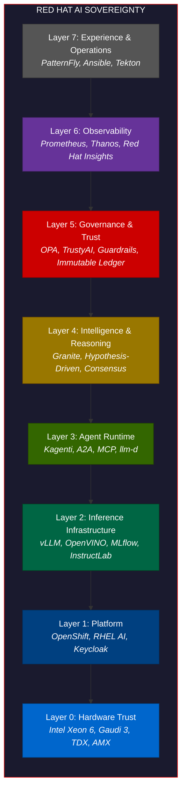

# Red Hat AI Sovereignty

**The premium on-premises AI platform. On par with the hyperscalers. On your infrastructure.**

The hyperscalers ask you to trust them with your AI. Red Hat gives you the platform to trust yourself, and the proof chain to show your auditor.

---

## The Pitch

Every enterprise running AI faces the same question: who controls it?

With a hyperscaler, the answer is the hyperscaler. Your data crosses a boundary you don't own. Your models run on infrastructure you don't control. Your governance is a promise, not a proof. And when the regulator asks for evidence, you get a PDF from a vendor.

Red Hat AI Sovereignty is the alternative. The same capabilities. Your infrastructure. Your governance. Your proof.

| Capability | Hyperscaler | Red Hat + Intel |
|-----------|------------|-----------------|
| Model serving | SageMaker / Vertex / Azure AI | **OpenShift AI** + vLLM + OpenVINO |
| Model registry | Vendor-locked registry | **MLflow** (open source, portable) |
| Model training | Cloud training APIs | **InstructLab** + **RHEL AI** |
| Open models | Closed APIs, closed weights | **Granite** (Apache 2.0, open weights) |
| Agent runtime | Bedrock Agents / Vertex Agents | **Kagenti** + A2A + MCP |
| Guardrails | Vendor guardrails | **Guardrails Orchestrator** (open source) |
| Fairness | SageMaker Clarify | **TrustyAI** (open source) |
| Identity | Cloud IAM (cloud-scoped) | **Keycloak** (your directory, your rules) |
| Policy | Cloud-native IAM | **OPA/Gatekeeper** (your policies, your code) |
| Compliance | Shared responsibility PDF | **Immutable ledger** + proof receipts (your proof) |
| Confidential compute | Nitro Enclaves | **Intel TDX** + Confidential Containers |
| Cost management | Cloud billing | **OpenShift Cost Management** + Kueue |
| Observability | CloudWatch / Vertex Monitoring | **Prometheus/Thanos** (you own the telemetry) |
| CI/CD for AI | SageMaker Pipelines | **Tekton** + OpenShift Pipelines |
| Console | Cloud console (vendor-locked) | **PatternFly** + OpenShift Console (open source) |
| Hardware | NVIDIA rental | **Intel Xeon 6 + Gaudi 3** (you own the silicon) |

**Five things a hyperscaler cannot give you:**

1. **Inspectable governance.** Every layer is open source. The code that made the decision is readable. The compliance proof chain is hash-chained in a ledger you run.
2. **Data that never leaves.** Not "we promise." The data physically never leaves your data center. Intel TDX proves it cryptographically. OPA enforces it at the policy layer.
3. **No GPU dependency.** Xeon 6 with AMX runs 2.4B-parameter models in integer math. The governance layer is pure CPU. No NVIDIA quota. No cloud GPU allocation.
4. **No vendor lock-in.** Every component is Apache 2.0. MLflow, not SageMaker. Keycloak, not AWS IAM. You can move the whole stack.
5. **The platform they already run.** OpenShift is in 90% of the Fortune 500. This is sovereign AI on the platform they already trust for everything else.

---

## The Stack

Eight layers. Every layer covered by Red Hat products, Intel hardware, and open-source projects.



---

## What We Built

10 platforms, 34 quickstarts, every one a proof point that this stack is real.

### Platforms

Integrated systems that implement multiple layers.

| Platform | What It Proves | Tests |
|----------|---------------|:-----:|
| [sovereign-ai-lab](https://github.com/jkershawrh/sovereign-ai-lab) | All 7 layers work together on one Xeon node | 33 |
| [fleet-llm-d](https://github.com/jkershawrh/fleet-llm-d) | Fleet-level inference orchestration at scale | 437 |
| [triforce](https://github.com/rhpds/triforce) | Red Hat + IBM + Intel multi-agent platform works | -- |
| [deepfield-fleet](https://github.com/jkershawrh/deepfield-fleet) | Predictive signal intelligence is composable | -- |
| [deepfield-multimodal](https://github.com/jkershawrh/deepfield-multimodal) | Three-tier agent cascade runs on Xeon 6 | -- |
| [launchpad](https://github.com/rhpds/launchpad) | One-click AI demos deploy to Gaudi 3 | -- |
| [stargate](https://github.com/rhpds/stargate) | AI-driven ops runs at RHDP scale | -- |
| [GeoLux](https://github.com/rhpds/GeoLux) | Governed agentic inference is production-viable | -- |
| [deepfield](https://github.com/rhpds/deepfield) | Fleet-scale signal intelligence compresses telemetry | -- |
| [are-immutable-ledger](https://github.com/jkershawrh/are-immutable-ledger) | Hash-chained proof receipts are tamper-evident | 116 |

### Quickstarts by Business Claim

Each quickstart proves a specific claim an enterprise cares about.

**"We can govern AI agents with provable trust"**

| Quickstart | Proof Point |
|-----------|-------------|
| [agent-promotion](https://github.com/jkershawrh/agent-promotion) | Authority earned by track record, revoked on failure. 180 tests. |
| [governed-cognitive-loop](https://github.com/jkershawrh/governed-cognitive-loop) | Evidence-based constraint classification and falsification before commit. |
| [governed-agent-execution](https://github.com/jkershawrh/governed-agent-execution) | Intent, risk, plan, and policy gates before any agent acts. |
| [llm-adversarial-falsification](https://github.com/jkershawrh/llm-adversarial-falsification) | 7 safety checks + adversarial probing before any action commits. |
| [agent-governance-kubernetes](https://github.com/jkershawrh/agent-governance-kubernetes) | Kagenti CRDs + SPIFFE identity on OpenShift. |
| [agent-certification-battery](https://github.com/jkershawrh/agent-certification-battery) | 6-check behavioral validation before production. |
| [agent-identity-verification](https://github.com/jkershawrh/agent-identity-verification) | Embedding fingerprints detect impersonation (3.6% EER). |
| [llm-response-quality-gate](https://github.com/jkershawrh/llm-response-quality-gate) | 10 check types across BDD/CDD/EDD/TDD dimensions. |

**"We can run inference without a GPU rental"**

| Quickstart | Proof Point | Intel |
|-----------|-------------|:-----:|
| [edge-ai-cpu-inference](https://github.com/jkershawrh/edge-ai-cpu-inference) | 2.4B params in 400MB, integer math, no GPU. | Xeon |
| [openvino-cpu-inference-server](https://github.com/jkershawrh/openvino-cpu-inference-server) | OpenVINO IR + INT8 on Xeon, OpenAI-compatible. | OpenVINO |
| [cpu-model-optimization-benchmark](https://github.com/jkershawrh/cpu-model-optimization-benchmark) | FP32 vs INT8 vs INT4 with AMX toggle. | AMX |
| [confidential-ai-inference](https://github.com/jkershawrh/confidential-ai-inference) | AES-256-XTS encrypted inference in TDX Trust Domains. | TDX |
| [vllm-gaudi-inference-server](https://github.com/jkershawrh/vllm-gaudi-inference-server) | vLLM on Gaudi HPUs, OpenAI-compatible API. | Gaudi |
| [speculative-decoding-accelerator](https://github.com/jkershawrh/speculative-decoding-accelerator) | Draft model in L3 cache proposes, target verifies. | Xeon |
| [disaggregated-inference-scheduler](https://github.com/jkershawrh/disaggregated-inference-scheduler) | Separate prefill/decode with SLO scheduling. | llm-d |
| [gpu-model-placement-optimizer](https://github.com/jkershawrh/gpu-model-placement-optimizer) | LP for minimum-cost model-to-accelerator assignment. | Gaudi |
| [cost-aware-request-routing](https://github.com/jkershawrh/cost-aware-request-routing) | Sub-ms classification routes to cheapest capable model. | Xeon |
| [enterprise-rag-intel-continuum](https://github.com/jkershawrh/enterprise-rag-intel-continuum) | Xeon handles 3/4 RAG steps, Gaudi handles generation. | Xeon+Gaudi |

**"We can match hyperscaler agent frameworks"**

| Quickstart | Proof Point |
|-----------|-------------|
| [three-tier-classification-cascade](https://github.com/jkershawrh/three-tier-classification-cascade) | 98% classified on CPU before anything expensive runs. |
| [hardware-tiered-agent-swarm](https://github.com/jkershawrh/hardware-tiered-agent-swarm) | 8 agents across 3 Intel hardware lanes in waves. |
| [multi-agent-health-assistant](https://github.com/jkershawrh/multi-agent-health-assistant) | 3 agents cooperate via A2A protocol. |
| [mcp-federated-tools](https://github.com/jkershawrh/mcp-federated-tools) | 16ms federated lookup replaces 3-8s LLM call. |
| [ai-pipeline-bootstrap](https://github.com/jkershawrh/ai-pipeline-bootstrap) | One LLM call generates an entire classification pipeline. |
| [multimodal-evidence-classifier](https://github.com/jkershawrh/multimodal-evidence-classifier) | 5 modalities through common schema with ONNX/OpenVINO. |

**"We can detect when AI goes wrong"**

| Quickstart | Proof Point |
|-----------|-------------|
| [inference-anomaly-detector](https://github.com/jkershawrh/inference-anomaly-detector) | Z-score on TTFT, throughput, KV-cache in real time. |
| [behavioral-drift-detector](https://github.com/jkershawrh/behavioral-drift-detector) | 36 metrics with Hotelling T-squared drift detection. |
| [slo-forecasting-predictive-scaling](https://github.com/jkershawrh/slo-forecasting-predictive-scaling) | Predict SLO breach 12 min ahead, pre-warm from calendar. |
| [closed-loop-ai-feedback](https://github.com/jkershawrh/closed-loop-ai-feedback) | Signal, decide, act, verify, learn: proves AI works. |
| [aiops-copilot](https://github.com/jkershawrh/aiops-copilot) | Classify, correlate, RCA with governance gates. |

**"Our AI can reason, not just generate"**

| Quickstart | Proof Point |
|-----------|-------------|
| [hypothesis-driven-reasoning](https://github.com/jkershawrh/hypothesis-driven-reasoning) | LLM asks falsifiable questions, code validates answers. |
| [llm-root-cause-hypothesis](https://github.com/jkershawrh/llm-root-cause-hypothesis) | Cross-modal evidence correlates into root cause. |
| [llm-stability-scoring](https://github.com/jkershawrh/llm-stability-scoring) | Logprob confidence: know when your LLM is hallucinating. |
| [llm-structured-output-repair](https://github.com/jkershawrh/llm-structured-output-repair) | Schema validation + iterative correction. |
| [multi-model-consensus](https://github.com/jkershawrh/multi-model-consensus) | 3 models answer, a judge synthesizes consensus. |
| [ai-rule-proposal-pipeline](https://github.com/jkershawrh/ai-rule-proposal-pipeline) | AI proposes its own rule improvements as PR-ready markdown. |
| [hybrid-fraud-detection](https://github.com/jkershawrh/hybrid-fraud-detection) | 60% rules + 40% LLM, skip LLM 70% of the time. |

---

## Red Hat Products in the Stack

Every gap maps to a Red Hat product or open-source project. The stack is complete.

| Layer | Red Hat Product | OSS Upstream | Intel Hardware |
|:-----:|----------------|-------------|----------------|
| 0 | RHEL Confidential Containers | Confidential Containers | **Xeon 6**, **Gaudi 3**, **TDX**, **AMX** |
| 1 | **OpenShift**, **RHEL AI**, Red Hat SSO | Keycloak | |
| 2 | **OpenShift AI** (MLflow, KServe) | InstructLab, Granite, vLLM, OpenVINO, llm-d, Kueue, MLflow | |
| 3 | | Kagenti (A2A + MCP) | |
| 4 | | Granite (open weights) | |
| 5 | | TrustyAI, OPA/Gatekeeper, Guardrails Orchestrator | |
| 6 | **Red Hat Insights** | Prometheus, Thanos | |
| 7 | **Ansible Automation**, **OpenShift Pipelines** | PatternFly, Tekton | |

---

## Composition Map

How quickstarts compose into platforms. Every arrow is a dependency that runs.

```mermaid
graph LR
    subgraph PLATFORMS["Platforms"]
        FLEET["fleet-llm-d<br/><i>Inference Orchestration</i>"]
        DEEP["deepfield<br/><i>Signal Intelligence</i>"]
        SAL["sovereign-ai-lab<br/><i>Governance Stack</i>"]
    end

    subgraph INF["Run Without GPU Rental"]
        vllm["vllm-gaudi"]
        ovino["openvino-cpu"]
        edge["edge-ai-cpu"]
        disag["disaggregated-scheduler"]
        spec["speculative-decoding"]
        gpu["gpu-placement"]
        cost["cost-aware-routing"]
    end

    subgraph AGT["Match Hyperscaler Agents"]
        cascade["3-tier-cascade"]
        swarm["hw-tiered-swarm"]
        mevid["multimodal-classifier"]
        pipe["pipeline-bootstrap"]
    end

    subgraph REASON["Reason, Not Just Generate"]
        hypo["hypothesis-reasoning"]
        rca["root-cause-hypothesis"]
        stab["stability-scoring"]
    end

    subgraph GOV["Govern with Provable Trust"]
        promo["agent-promotion"]
        gcl["governed-cognitive-loop"]
        gae["governed-agent-exec"]
        adv["adversarial-falsification"]
        agk["agent-gov-k8s"]
        cert["agent-certification"]
        ident["agent-identity"]
        qgate["response-quality-gate"]
    end

    subgraph OBS["Detect When AI Goes Wrong"]
        anom["anomaly-detector"]
        drift["drift-detector"]
        slo["slo-forecasting"]
        cloop["closed-loop-feedback"]
        aiops["aiops-copilot"]
    end

    subgraph TRUST["Trust Infrastructure"]
        ledger["are-immutable-ledger"]
        tdx["confidential-ai"]
    end

    vllm & ovino & edge & disag & spec --> FLEET
    gpu & cost & swarm --> FLEET
    anom & drift & slo --> FLEET

    cascade & mevid & pipe --> DEEP
    hypo & rca & stab --> DEEP
    cloop & aiops --> DEEP

    ledger & tdx --> SAL
    promo & gcl & gae & adv --> SAL
    agk & cert & ident & qgate --> SAL

    style PLATFORMS fill:#cc0000,stroke:#990000,color:#fff
    style INF fill:#006644,stroke:#004422,color:#fff
    style AGT fill:#336600,stroke:#224400,color:#fff
    style REASON fill:#997700,stroke:#664400,color:#fff
    style GOV fill:#880000,stroke:#660000,color:#fff
    style OBS fill:#663399,stroke:#442266,color:#fff
    style TRUST fill:#0066cc,stroke:#004080,color:#fff
```



---

## Industry Verticals

The stack applies to any industry where AI mistakes have real cost. See [agent-promotion/docs/vertical-mappings.md](https://github.com/jkershawrh/agent-promotion/blob/main/docs/vertical-mappings.md) for six worked examples:

| Vertical | Consequence Metric | Business Value |
|----------|-------------------|----------------|
| **Ad Tech** | Spend authority ($) | ROAS-governed campaign optimization |
| **Financial Services** | Position size ($) | Sharpe-governed algorithmic trading |
| **Healthcare** | Patient acuity score | Accuracy-governed clinical decision support |
| **Supply Chain** | Purchase order value ($) | Fill-rate-governed procurement |
| **Cybersecurity** | Response severity | TPR-governed incident response |
| **Energy** | Load capacity (MW) | Forecast-governed grid operations |

---

## Interactive Demo

The [portfolio visualization](demo/) is a React Flow canvas showing the full stack as an interactive node graph. Platforms, quickstarts, Red Hat products, Intel hardware, and OSS projects as navigable, filterable nodes with composition edges.

```bash
cd demo && npm install && npm run dev
```

---

## The Close

> The hyperscalers ask you to trust them with your AI.
>
> Red Hat gives you the platform to trust yourself, and the proof chain to show your auditor.
>
> Governed AI on the platform you already run.

---

## Numbers

| | Count |
|--|:-----:|
| Platforms | 10 |
| Quickstarts | 34 |
| Red Hat products mapped | 8 |
| Intel hardware mapped | 4 |
| OSS projects integrated | 14 |
| Industry verticals mapped | 6 |
| **Total proof points** | **48 repos** |

## License

Apache 2.0
